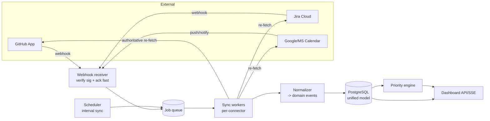
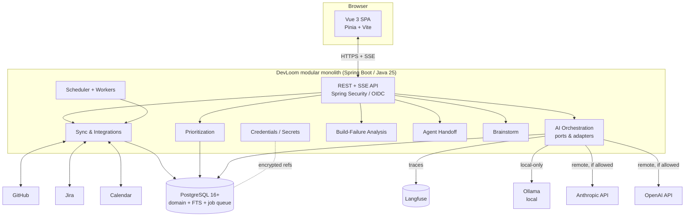
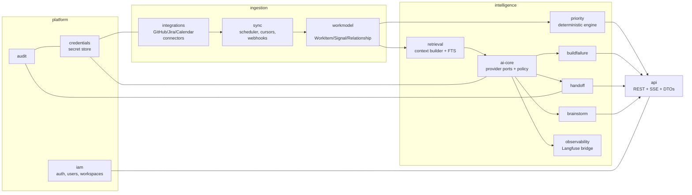
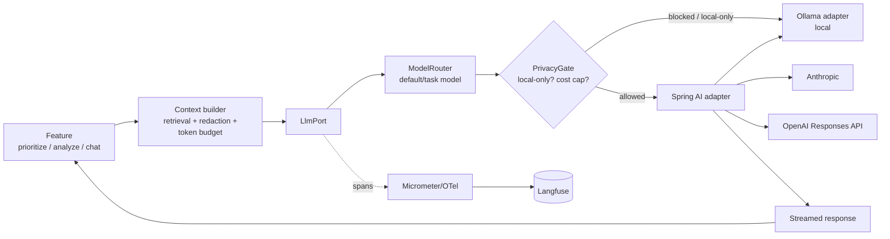
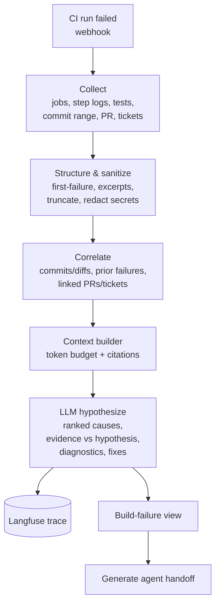

# DevLoom — Product & Technical Specification

> **Status:** Phase 1 deliverable — draft for review.
> **Date:** 2026-08-08. **Working name:** DevLoom.
> **Scope of this document:** Product + technical specification only. No implementation. UI/UX design (Phase 2) begins only after this specification is approved.

**How to read this document.** Major recommendations use a consistent decision block:

> **Decision.** What we chose.
> **Why.** The reasoning.
> **Alternatives.** What else was considered.
> **Trade-offs.** What we give up.
> **MVP?** Required / Deferred / Optional.

Assumptions are marked **[ASSUMPTION]** inline and collected in §39. Opinionated calls and warnings are marked **⚠️**.

---

## Table of contents

1. [Executive summary](#1-executive-summary)
2. [Product principles](#2-product-principles)
3. [Target users and personas](#3-target-users-and-personas)
4. [Problems being solved](#4-problems-being-solved)
5. [Jobs to be done](#5-jobs-to-be-done)
6. [Primary user journeys](#6-primary-user-journeys)
7. [Functional requirements](#7-functional-requirements)
8. [Non-functional requirements](#8-non-functional-requirements)
9. [MVP scope](#9-mvp-scope)
10. [Future scope](#10-future-scope)
11. [Non-goals](#11-non-goals)
12. [Integration strategy](#12-integration-strategy)
13. [External-provider permissions and OAuth scopes](#13-external-provider-permissions-and-oauth-scopes)
14. [Data synchronization and webhook strategy](#14-data-synchronization-and-webhook-strategy)
15. [Unified domain model](#15-unified-domain-model)
16. [Suggested PostgreSQL data model](#16-suggested-postgresql-data-model)
17. [System architecture](#17-system-architecture)
18. [Backend module boundaries](#18-backend-module-boundaries)
19. [Frontend architecture](#19-frontend-architecture)
20. [LLM provider architecture](#20-llm-provider-architecture)
21. [Retrieval and context-building strategy](#21-retrieval-and-context-building-strategy)
22. [Priority-ranking design](#22-priority-ranking-design)
23. [Build-failure analysis pipeline](#23-build-failure-analysis-pipeline)
24. [Coding-agent handoff format](#24-coding-agent-handoff-format)
25. [Prompt management and Langfuse observability](#25-prompt-management-and-langfuse-observability)
26. [Security, privacy, and threat model](#26-security-privacy-and-threat-model)
27. [Credential management](#27-credential-management)
28. [Multi-tenancy and authorization model](#28-multi-tenancy-and-authorization-model)
29. [Data retention and deletion](#29-data-retention-and-deletion)
30. [Reliability, retries, idempotency, and rate limits](#30-reliability-retries-idempotency-and-rate-limits)
31. [Testing strategy](#31-testing-strategy)
32. [Deployment options](#32-deployment-options)
33. [Local-development environment](#33-local-development-environment)
34. [Key API endpoints or contracts](#34-key-api-endpoints-or-contracts)
35. [Important architectural decisions and alternatives](#35-important-architectural-decisions-and-alternatives)
36. [Risks and mitigations](#36-risks-and-mitigations)
37. [Success metrics](#37-success-metrics)
38. [Milestones and recommended implementation order](#38-milestones-and-recommended-implementation-order)
39. [Open questions and assumptions](#39-open-questions-and-assumptions)
40. [Claude Skills Plan](#40-claude-skills-plan)
41. [Phase 1 closeout](#41-phase-1-closeout)

---

## 1. Executive summary

DevLoom is a **calm engineering command center**: one place where a developer can understand everything in flight across their tools and decide what to do next — backed by evidence, not vibes.

It ingests work signals from Jira, GitHub, and **both Google and Microsoft calendars** (MVP), builds a **unified work model**, and answers five questions the moment the user opens it:

1. What needs my attention?
2. Why does it matter?
3. What changed since I last looked?
4. What is blocked (and on whom)?
5. What should I do next — and what evidence supports that?

DevLoom uses an LLM for reasoning that humans are bad at doing quickly at scale — summarizing change, explaining *why* something is urgent, diagnosing a failed build, and generating a **structured handoff prompt** a coding agent (Claude Code, Codex, etc.) can act on. Crucially, **priority is not an opaque LLM verdict**: a deterministic scoring engine produces the ranking and its inputs; the LLM explains and augments, always citing the source items (ticket, PR, build log, commit, calendar event, doc).

The system is **provider-neutral for AI and local-first**: free, open models run locally through Ollama (Qwen, gpt-oss, Gemma, Mistral, and anything on Hugging Face that Ollama can run) and are the **first-class default**; users may **optionally** bring their own Anthropic or OpenAI key when they want a frontier model. Users choose default and per-task models and see exactly when data will leave their machine. LLM calls run on the backend only; keys never reach the browser. Everything is observable through a **self-hosted Langfuse** (a required MVP component).

**Recommended stack** (evaluated, not accepted blindly): **Java 25 (LTS) · Spring Boot 4 (4.1) / Spring Framework 7 · PostgreSQL 16+ · Vue 3 + TypeScript + Vite + Pinia · Docker Compose for local dev and self-hosted deployment**, structured as a **modular monolith** in a **monorepo**. The AI layer is a **thin internal abstraction (ports & adapters) with Spring AI 2.0 as the primary adapter**, so provider quirks stay out of product-domain code. (Spring Boot 4 confirmed by the product owner.)

> **Product-owner decisions folded into this revision (2026-08-08):** deployment is **self-hosted** for now; **Langfuse is required and self-hosted**; **both Google and Microsoft calendars** are in the MVP; **team features are deferred** (near-term focus is a single self-hosted user — a workspace of one); AI is **local-first with optional bring-your-own Anthropic/OpenAI keys**; **Spring Boot 4** confirmed. See §39/§41 for the remaining open questions.

**The ten most important decisions, the MVP boundary, the five biggest risks, and the questions I need answered are in §41.** This document ends there and stops for your approval before any Phase 2 (UI/UX) work.

---

## 2. Product principles

1. **Evidence over assertion.** Every recommendation, risk, and summary links to the source items that justify it. Uncertain LLM output is labeled as a hypothesis, never presented as fact.
2. **Deterministic where it matters.** Prioritization, blocking, and freshness are computed from explicit signals. The LLM explains and enriches; it does not secretly decide rank.
3. **Calm, not noisy.** DevLoom answers "what deserves attention" and hides the rest. It is not a second inbox or a wall of cards.
4. **User owns the AI boundary.** The user chooses providers, models, and what may leave their machine. Local-only is a first-class mode. Data egress is always visible before it happens.
5. **Explainable and correctable.** Users can see why something ranked where it did, override it, and say why. The system learns from overrides without silently changing important behavior.
6. **Safe by default with agents.** DevLoom prepares work for agents (handoff prompts). It does not push, merge, deploy, or make destructive changes without explicit, scoped approval.
7. **Depth over breadth.** A few integrations done deeply beat shallow support for everything.
8. **Secrets are sacred.** Credentials, prompts, and source content are encrypted, redacted in logs/traces, access-controlled, and deletable on request.
9. **Read-first, write-rare.** DevLoom mostly reads. Any write to an external system is an explicit, audited, reversible-where-possible action.
10. **Graceful degradation.** A down integration or LLM provider degrades one panel, never the whole product.

---

## 3. Target users and personas

**Primary market:** an individual developer or a small engineering team (2–15 people) using GitHub + Jira + a calendar. [ASSUMPTION: initial buyers are self-serve individuals and small teams, not enterprise procurement.]

- **Persona A — "Maya," senior full-stack engineer (primary).** Juggles ~6 active PRs, reviews for teammates, an on-call rotation, and two epics. Pain: context-switching cost; forgetting stale PRs waiting on her; discovering a red build only when someone pings her. Wants: a single "what's on fire / what's next" view and fast build triage.
- **Persona B — "Devin," tech lead / staff engineer.** Cares about team throughput, blocked teammates, and review latency. Pain: no cross-tool view of who's blocked on what; reviews aging silently. Wants: blocker and review-latency visibility; help preparing for planning and 1:1s.
- **Persona C — "Priya," solo founder / indie dev.** One repo, a Jira/linear-style board, a calendar. Pain: everything is in her head. Wants: a low-noise daily "start here" and help turning a red CI run into an agent-ready prompt.
- **Secondary — "Sam," engineering manager (later).** Wants aggregate health (build failure rates, review latency), not individual surveillance. Explicitly out of MVP to avoid a surveillance framing.

**Anti-persona.** Large enterprise with SSO/SCIM, audit, and data-residency mandates as a *precondition* — supported later, not a v1 gate.

---

## 4. Problems being solved

1. **Fragmentation.** Work state is scattered across Jira, GitHub, calendars, and chat. No single answer to "what's my situation right now."
2. **Prioritization is manual and inconsistent.** Developers re-derive "what's most important" many times a day from incomplete information.
3. **Blockers and stale work are invisible.** A PR waiting three days on a review, a ticket blocked on another team, a teammate blocked on you — none of these surface until they hurt.
4. **Build failures are slow to triage.** Reading logs, correlating to commits/diffs/tickets, and forming a hypothesis is repetitive toil.
5. **Handing work to a coding agent is high-effort.** Assembling repo, branch, commit range, logs, constraints, and acceptance criteria into a good prompt is tedious and error-prone.
6. **Change is hard to catch up on.** "What happened since yesterday" requires visiting every tool.
7. **AI tools are opaque and privacy-hostile.** Users can't tell what data leaves, to whom, or why a suggestion was made.

---

## 5. Jobs to be done

- When I start my day, **help me decide what to work on first**, with reasons and evidence, so I stop re-deriving priority.
- When a build fails, **tell me the most likely cause and next step**, distinguishing evidence from hypothesis, so I triage in minutes.
- When I'm ready to delegate, **generate a complete, safe agent handoff** so I can paste it into a coding agent with confidence.
- When something is waiting on me (or I'm waiting on someone), **surface it before it goes stale**.
- When I return after time away, **summarize what changed** across my work.
- Before a meeting, **prepare me** with the relevant tickets, PRs, and decisions.
- When I disagree with a priority, **let me override and explain**, and don't fight me next time.
- Throughout, **keep my keys and source data private and let me control what leaves my machine.**

---

## 6. Primary user journeys

**J1 — Morning triage (the core loop).** Maya opens DevLoom → the dashboard shows a ranked "Next" list. Top card: "Review PR #482 — teammate blocked 2 days, CI green, merges the release." She expands it → sees the deterministic signals (blocked teammate, review wait 51h, release-labeled) and an LLM explanation citing the PR and the linked ticket. She acts, or snoozes, or overrides priority with a reason.

**J2 — Build-failure triage.** A card shows "CI failed on `feature/pricing` — 1st failure." She opens the build-failure screen → concise summary, exact failing job/test, ranked hypotheses with evidence (failing assertion + the commit that touched that file), suggested diagnostics, potential fixes, and a one-click **"Generate agent handoff."**

**J3 — Agent handoff.** From J2 (or any PR/ticket), she reviews the generated handoff (repo, branch, commit range, logs excerpt, hypotheses, constraints, acceptance criteria, allowed/forbidden commands), edits, and copies it into Claude Code. DevLoom never runs the agent itself in MVP.

**J4 — Catch-up after time off.** Devin returns Monday → "What changed" summary: PRs merged, tickets moved, builds that broke and recovered, new reviews requested — each linking to sources.

**J5 — Brainstorming workspace.** Priya starts a blank chat, attaches a ticket + a failing build + a repo, sees exactly which sources are in context, switches model to a local Ollama model for a private repo, and saves the output as a draft spec/task/decision linked back to its sources.

**J6 — Provider & privacy setup.** First-run: add an Anthropic key (stored encrypted, validated with a test call), pick a default model, mark one repo "local-only," set a monthly cost cap. A banner always shows what will leave the machine for any AI action.

---

## 7. Functional requirements

Grouped; `MUST`/`SHOULD`/`MAY` per RFC 2119. "M/N/L" = MVP / Next / Later.

**Authentication & accounts**
- FR-1 (M, MUST) Users authenticate via OIDC (see §26). Sessions are backend-managed.
- FR-2 (M, MUST) A user belongs to exactly one **workspace** (tenant); workspace is the isolation and sharing boundary (§28).

**Integrations & sync**
- FR-3 (M, MUST) Connect GitHub, Jira, and **both** Google Calendar **and** Microsoft Outlook Calendar via OAuth (the user may connect either or both); store tokens encrypted (§27).
- FR-4 (M, MUST) Periodic background sync + webhook ingestion where available (§14) for issues, PRs, reviews, CI runs, deployments, calendar events.
- FR-5 (M, MUST) Show per-integration **sync status** (last success, in-progress, failed, partial) and last-updated timestamps on derived data.
- FR-6 (N) Bitbucket and GitLab source/CI providers. FR-7 (N) Notion. FR-8 (L) Slack/Teams.

**Unified dashboard**
- FR-9 (M, MUST) A unified view of: my tasks, my PRs/MRs, reviews requested of me, build/deploy failures, upcoming meetings/deadlines, blockers, stale/waiting work.
- FR-10 (M, MUST) A ranked **"Next" list** with per-item evidence and explanation (§22).
- FR-11 (M, MUST) Each item links to its source(s) and shows freshness.
- FR-11a (M, MUST) **Flag stale PRs the user authored** — PRs with no update/activity for a configurable threshold (default 3 business days [ASSUMPTION]) surface as a first-class dashboard item and feed a `stale_authored_pr` priority signal (§22). Distinct from "review waiting on me": this is *my* work going cold.
- FR-12 (N) Team view (blocked teammates, review latency) — privacy-scoped, opt-in.

**Prioritization & learning**
- FR-13 (M, MUST) Deterministic priority score computed from explicit signals (§22), with the signal breakdown visible.
- FR-14 (M, MUST) LLM explanation of *why* an item matters, citing sources; labeled as reasoning, not fact.
- FR-15 (M, SHOULD) User can override priority and record a reason.
- FR-16 (N) System learns from overrides (weight adjustments / user preferences) with an audit trail and no silent behavior change.

**Intelligent assistance**
- FR-17 (M, MUST) "What changed since I last looked" summary with citations.
- FR-18 (M, MUST) Build-failure analysis (§23): summary, failing stage/test, log excerpts, ranked hypotheses with evidence, related commits/PRs/tickets, diagnostics, potential fixes.
- FR-19 (M, MUST) Generate a coding-agent handoff (§24) from a build failure, PR, or ticket.
- FR-20 (N) Meeting preparation. FR-21 (N) Suggest improvements to tasks/specs/PRs/plans. FR-22 (N) Identify conflicts/risks/missing info across items.
- FR-22a (N, SHOULD) **Suggest relevant external articles/news** for the user's active projects and open PRs (e.g. a CVE in a dependency the PR touches, a release/changelog for a framework in use, a relevant blog post/discussion). Each suggestion **shows its source link** and *why it's relevant* (which project/PR/keyword triggered it), is **dismissible**, and is **egress-gated** (§20/§26): suggestions are derived from project/PR *metadata and topics*, never from source code of a **local-only** repo, and the external lookup only happens for repos the user has allowed to egress. ⚠️ Requires an external news/search source (LLM web-search where the provider supports it, or a news/search API) — hence Next, not MVP.
- FR-23 (L) Invoke agents directly, only with explicit scoped approval and safety controls (§26).

**Brainstorming workspace**
- FR-24 (M, MUST) Conversational workspace; blank start; attach tickets/docs/PRs/builds/repos/calendar events as context; show exactly which sources are included; add/remove sources; switch models.
- FR-25 (M, SHOULD) Save output as note / proposed task / decision / draft spec, linked to sources; export conversation or generated agent prompt.
- FR-26 (M, MUST) Separate personal from workspace-visible content; default to personal.

**AI provider & privacy controls**
- FR-27 (M, MUST) Configure multiple providers (Anthropic, OpenAI, Ollama); test connection; choose default model; choose per-task models.
- FR-28 (M, MUST) Mark repos/projects **local-only** (Ollama-only processing).
- FR-29 (M, MUST) Show, before any AI action, whether/what data will leave the machine and to which provider.
- FR-30 (M, SHOULD) Set cost/usage limits; warn/stop at threshold.
- FR-31 (M, MUST) Fallback to another provider only when explicitly configured (never silent).

**Observability & admin**
- FR-32 (M, MUST) LLM calls traced in a **self-hosted Langfuse** (traces, tokens, cost, model, latency, tool calls, feedback) with secret/source redaction (§25).
- FR-33 (M, MUST) Audit log of credential use and external writes (§26).
- FR-34 (M, MUST) Delete a connected integration and its derived data; delete account/workspace data on request (§29).

---

## 8. Non-functional requirements

- **NFR-1 Performance.** Dashboard first meaningful render < 1.5s p95 on cached data; ranked list computed from local DB, never blocking on live API calls. LLM actions are async with streamed output (SSE).
- **NFR-2 Freshness.** Webhook-driven items reflect changes < 30s p95; polled items within their sync interval (default 5–15 min, §14).
- **NFR-3 Availability.** Single-node target 99.5% for self-host; degrade per-integration rather than fail whole.
- **NFR-4 Scale (MVP).** Design for ~50 workspaces / ~200 users / ~50k tracked work-items per node. Horizontal scale is a Later concern (modular monolith keeps the door open).
- **NFR-5 Security.** Keys never in browser; encryption at rest for secrets; TLS in transit; redaction in logs/traces; least-privilege OAuth scopes. (§26–27)
- **NFR-6 Privacy.** Local-only mode guarantees no source content leaves the deployment for flagged repos. Data-egress transparency for every AI action.
- **NFR-7 Cost control.** Per-user/workspace token budgets enforced backend-side; hard stop and clear messaging at cap.
- **NFR-8 Accessibility.** WCAG 2.2 AA target for the UI (detailed in Phase 2).
- **NFR-9 Observability.** Structured logs, metrics (Micrometer), health/readiness endpoints, LLM traces.
- **NFR-10 Portability.** Runs via Docker Compose on a single host; no managed-cloud lock-in required.
- **NFR-11 Data integrity.** Sync is idempotent; external writes are idempotent and audited (§30).
- **NFR-12 Internationalization.** English-only UI for MVP; no hard blockers to i18n later.

---

## 9. MVP scope

> **Decision.** Ship a focused MVP for a **single self-hosted user** (a workspace of one) on **GitHub + Jira + both Google and Microsoft calendars**, with the unified dashboard, evidence-backed prioritization, build-failure analysis, agent handoff, brainstorming chat, **local-first AI (Ollama) with optional bring-your-own Anthropic/OpenAI keys**, and a **required self-hosted Langfuse**.
> **Why.** These deliver the core "what's next + why + fix the build + hand it off" loop with depth for the product owner's own use. Everything else is additive.
> **Alternatives.** (a) Broader integration set (Bitbucket/GitLab/Notion) shallowly — rejected (principle: depth over breadth). (b) LLM-only prioritization — rejected (principle: deterministic where it matters). (c) Team features at launch — deferred at the product owner's request.
> **Trade-offs.** No multi-SCM, no Notion, no team analytics at launch. Single-user focus keeps tenancy simple now (the workspace model still stands so multi-user is additive, §28).
> **MVP?** This *is* the MVP.

**In (MVP):** Auth (single-user self-hosted login, §26); GitHub, Jira, Google **and** Microsoft calendars; background sync + webhooks; unified work dashboard; PR/review tracking; deterministic priority + LLM explanation with citations; "what changed" summary; basic CI failure analysis; agent handoff generation; brainstorming chat with source attachment; **local-first AI via Ollama (free open models) + optional BYO Anthropic/OpenAI keys**; provider/privacy/cost settings; **self-hosted Langfuse tracing (required)**; audit logging; integration + account data deletion.

⚠️ **Cut from the proposed MVP if the timeline is tight** (recommended trims, in order): (1) "what changed" summary → Next; (2) cost limits → soft warning only; (3) override-learning (already Next). Keep build-failure analysis and handoff — they are the differentiators.

## 10. Future scope

**Next release:** Bitbucket + GitLab (source/CI); Notion; team view (blockers, review latency); meeting prep; suggestion features (FR-21/22); **relevant articles/news suggestions for active projects & PRs (FR-22a)** — needs an external news/search source and an egress path, so it lands here rather than MVP; override-learning (FR-16); pgvector-backed semantic retrieval *if* justified (§21).

**Later:** Slack/Teams; direct agent invocation with approvals (FR-23); manager/aggregate health; SSO/SAML + SCIM; audit export + data-residency policies; multi-node horizontal scale; mobile.

## 11. Non-goals

- **Not** a project-management tool or a Jira/GitHub replacement (no board editing as a primary surface in MVP).
- **Not** a chat/notification hub or a second inbox.
- **Not** an autonomous agent that writes/pushes/deploys code unattended (MVP prepares work; it does not perform it).
- **Not** a manager surveillance/productivity-scoring tool.
- **Not** a general BI/analytics platform.
- **Not** a data warehouse; we cache what we need to answer the five questions, nothing more.

---

## 12. Integration strategy

> **Decision.** Adopt a **provider-adapter pattern** behind a normalized ingestion pipeline. Each external system (GitHub, Jira, Calendar) implements a small `SourceConnector` port that emits **normalized domain events** into a common sync pipeline; nothing downstream knows which SCM/tracker produced an item.
> **Why.** Keeps the unified domain model (§15) clean, makes Bitbucket/GitLab/Notion additive, and isolates each provider's auth/rate-limit/webhook quirks.
> **Alternatives.** Per-provider vertical slices (fast for one provider, poor reuse); a third-party unified-API SaaS (adds cost, egress, and a trust dependency — rejected for a privacy-first product).
> **Trade-offs.** Upfront normalization cost; some provider-specific richness is flattened (kept in a `raw` JSONB escape hatch, §16).
> **MVP?** Required (GitHub, Jira, Google Calendar, Microsoft Outlook Calendar).

**Depth-first coverage per MVP integration:**

- **GitHub:** repositories, PRs (author, reviewers, requested reviews, state, mergeability, labels), reviews & review requests, issues, **CI via Checks API / workflow runs**, deployments. Prefer the **Checks API + `workflow_run`/`check_run` webhooks** for CI signal.
- **Jira:** issues, epics, sprints, comments, status, assignee, priority, due dates, issue links (blocks/blocked-by → dependency graph).
- **Calendar (Google *and* Microsoft — both in MVP):** events, attendees, times, focus-time/free-busy; used for calendar-constraint signals and meeting prep. Both providers normalize to the same `CALENDAR_EVENT` WorkItem, so downstream code is calendar-agnostic; the user may connect either or both.

**Design rules:** every connector is (1) idempotent, (2) resumable (cursor/delta tokens), (3) rate-limit aware (§30), (4) able to backfill on first connect and then run incrementally, (5) degrade independently.

## 13. External-provider permissions and OAuth scopes

Principle: **least privilege, read-mostly.** Request the narrowest scopes that satisfy MVP reads; request write scopes only for explicitly-enabled write actions (none required for core MVP).

| Provider | MVP scopes (read) | Notes / write (opt-in, later) |
|---|---|---|
| **GitHub** | Prefer a **GitHub App** (fine-grained, per-repo install) over OAuth PAT. Permissions: `Contents: Read`, `Pull requests: Read`, `Issues: Read`, `Checks: Read`, `Actions: Read`, `Deployments: Read`, `Metadata: Read`. | GitHub App gives per-repo consent, short-lived installation tokens, and webhook delivery — best fit for privacy + least-privilege. Write (`Pull requests: Write` for comments) only if/when comment-back is enabled. |
| **Jira (Atlassian)** | OAuth 2.0 (3LO): `read:jira-work`, `read:jira-user`, `offline_access` (refresh). | Write (`write:jira-work`) only for future "update ticket" actions. |
| **Google Calendar** | `https://www.googleapis.com/auth/calendar.events.readonly`, `calendar.readonly`, `openid email profile`. | Use incremental auth; request calendar scope only when the user connects calendar. |
| **Microsoft Outlook Calendar** | `Calendars.Read`, `offline_access`, `openid email profile`. | Microsoft Graph; delegated permissions. |

**⚠️ Recommendation:** implement GitHub as a **GitHub App**, not a classic OAuth app — fine-grained per-repo permissions are essential to the local-only/privacy story and to least privilege. [ASSUMPTION: acceptable to ask users to install a GitHub App.]

**Read-only in MVP, write-ready by design (decided).** MVP requests **read scopes only** and performs no external writes. But the architecture is built so write-back (PR comment, Jira update, etc.) can be added later without rework: (1) connectors expose a distinct, currently-empty `WriteAction` capability separate from reads; (2) the write OAuth scopes above are documented and requested **only** when a write feature is enabled; (3) every write path is designed to be idempotent (idempotency keys) and audited (§30/§26) from day one. So "turning on writes" later is a feature flag + scope upgrade, not a redesign.

All scopes, the exact data each grants, and the resulting **data-egress implications** are surfaced in-product at connect time (FR-29).

## 14. Data synchronization and webhook strategy

> **Decision.** **Hybrid sync:** webhooks for low-latency change signals where available (GitHub, Jira, Google/Microsoft push channels), plus **scheduled reconciliation polling** as the source of truth and gap-filler. Webhooks *invalidate/refresh*; polling *guarantees eventual consistency*.
> **Why.** Webhooks are fast but lossy (missed deliveries, downtime); polling is reliable but slow. Together they give < 30s p95 freshness without trusting webhooks for correctness.
> **Alternatives.** Poll-only (simpler, stale); webhook-only (fast, unreliable, correctness gaps).
> **Trade-offs.** Two code paths to maintain; must dedupe/idempotently merge webhook + poll updates.
> **MVP?** Required. (Webhooks for GitHub + Jira; calendar via incremental sync tokens / push where practical.)

**Mechanics.**
- **Scheduler:** a background job runner (see §17) runs per-connector incremental syncs on an interval (default: PRs/issues 5–10 min, CI 2–5 min, calendar 15 min; configurable). First connect = bounded backfill.
- **Cursors:** each connector persists delta cursors (GitHub `updated_at`/ETags + delivery IDs; Jira JQL `updated >=` + `nextPageToken`; Google `syncToken`; Microsoft `deltaLink`).
- **Webhook intake:** verify signatures (GitHub HMAC-SHA256, Jira/Atlassian JWT, Google channel token, Microsoft `clientState`/validationToken), enqueue, ack fast (< 2s), process async. Never trust webhook body as sole source — treat as a "refresh this entity" hint and re-fetch authoritative state.
- **Idempotency:** every ingested change carries a natural key (`provider + external_id + updated_at/etag`); upserts are idempotent; out-of-order deliveries resolved by version/timestamp.
- **Backpressure & rate limits:** per-provider token-bucket limiter; honor `Retry-After`/rate-limit headers; exponential backoff with jitter (§30).



## 15. Unified domain model

The core insight: normalize heterogeneous sources into a small set of **work entities** plus a **signal/relationship** layer that prioritization and retrieval consume.

**Core entities**
- **Workspace** — tenant/isolation boundary. **User** — belongs to a workspace; may map to multiple external accounts (`ExternalIdentity`).
- **Integration** — a connected provider instance for a workspace (holds encrypted credentials, scopes, sync state).
- **WorkItem** — the unifying abstraction. A `type` discriminator: `TASK` (Jira issue/epic), `PULL_REQUEST` (GitHub PR / future MR), `REVIEW_REQUEST`, `BUILD` (CI run), `DEPLOYMENT`, `CALENDAR_EVENT`, `DOCUMENT` (Notion, later). Common fields: title, state, assignee/author, timestamps, url, `source_ref`, `raw` (JSONB).
- **Project / Initiative** — grouping (Jira project/epic, GitHub repo, or a DevLoom-defined initiative spanning both).
- **Relationship** — typed edges between WorkItems: `BLOCKS`, `BLOCKED_BY`, `LINKED_TO`, `REVIEWS`, `PART_OF`, `CAUSED_BY` (build→commit), `REFERENCES`. Powers the dependency/blocker graph.
- **Signal** — a computed, typed, timestamped fact about a WorkItem used by prioritization (e.g. `review_wait_hours=51`, `blocks_teammate=true`, `deadline_in_hours=18`, `build_impact=prod`). Signals are **first-class and inspectable**.
- **PriorityScore** — the deterministic score + component breakdown + version, per user per WorkItem.
- **Recommendation** — an LLM-produced explanation/next-step, always with `citations: [WorkItem/source refs]` and a `confidence` + `is_hypothesis` flag.
- **Override** — a user's manual priority/importance adjustment + reason (feeds learning, Next).
- **BrainstormSession / Message / AttachedSource** — chat workspace, its turns, and the explicit source set in context (with visibility scope personal/workspace).
- **AgentHandoff** — a generated, versioned handoff artifact linked to its originating WorkItem(s).
- **AuditEvent** — credential use, external writes, deletions.

**Why "WorkItem + Signal + Relationship":** prioritization and retrieval stay provider-agnostic; adding Bitbucket/GitLab/Notion means new connectors emitting the same shapes — no changes to the ranking or UI layers.

## 16. Suggested PostgreSQL data model

> **Decision.** PostgreSQL 16+ with **normalized core tables + JSONB `raw`** escape hatch; **Flyway** migrations; **Postgres full-text search** for MVP retrieval; **pgvector deferred** (§21).
> **Why.** Relational integrity for the domain, JSONB to avoid modeling every provider field up front, FTS avoids an embedding pipeline for v1.
> **Alternatives.** Document DB (loses relational queries for the dependency graph); separate search engine (Elastic/OpenSearch) — unjustified infra for MVP.
> **Trade-offs.** JSONB `raw` can become a crutch; enforce that anything prioritization/UI needs is promoted to typed columns.
> **MVP?** Required (pgvector optional/Later).

Representative schema (abbreviated; illustrative types):

```sql
-- Tenancy & identity
CREATE TABLE workspace (id UUID PK, name TEXT, created_at TIMESTAMPTZ);
CREATE TABLE app_user (id UUID PK, workspace_id UUID FK, email CITEXT UNIQUE,
  display_name TEXT, created_at TIMESTAMPTZ);
CREATE TABLE external_identity (id UUID PK, user_id UUID FK, provider TEXT,
  external_user_id TEXT, UNIQUE(provider, external_user_id));

-- Integrations & sync state (secrets stored via §27, NOT plaintext here)
CREATE TABLE integration (id UUID PK, workspace_id UUID FK, provider TEXT,
  status TEXT, scopes TEXT[], credential_ref TEXT,       -- ref into secret store
  sync_cursor JSONB, last_sync_at TIMESTAMPTZ, last_error TEXT,
  local_only BOOLEAN DEFAULT FALSE);

-- Unified work model
CREATE TABLE project (id UUID PK, workspace_id UUID FK, provider TEXT,
  external_id TEXT, name TEXT, importance SMALLINT, raw JSONB,
  UNIQUE(provider, external_id, workspace_id));

CREATE TABLE work_item (
  id UUID PK, workspace_id UUID FK,
  type TEXT NOT NULL,                    -- TASK|PULL_REQUEST|REVIEW_REQUEST|BUILD|DEPLOYMENT|CALENDAR_EVENT|DOCUMENT
  provider TEXT NOT NULL, external_id TEXT NOT NULL,
  project_id UUID FK NULL, title TEXT, state TEXT,
  assignee_user_id UUID NULL, author_user_id UUID NULL,
  url TEXT, priority_explicit SMALLINT NULL,
  due_at TIMESTAMPTZ NULL, external_updated_at TIMESTAMPTZ,
  fetched_at TIMESTAMPTZ, raw JSONB,
  search_tsv tsvector,                   -- FTS
  UNIQUE(provider, external_id, workspace_id));
CREATE INDEX ON work_item USING GIN (search_tsv);
CREATE INDEX ON work_item (workspace_id, type, state);
CREATE INDEX ON work_item (assignee_user_id);

CREATE TABLE relationship (id UUID PK, workspace_id UUID FK,
  src_work_item_id UUID FK, dst_work_item_id UUID FK, type TEXT,
  UNIQUE(src_work_item_id, dst_work_item_id, type));

CREATE TABLE signal (id UUID PK, work_item_id UUID FK, workspace_id UUID FK,
  key TEXT, num_value DOUBLE PRECISION NULL, bool_value BOOLEAN NULL,
  text_value TEXT NULL, computed_at TIMESTAMPTZ,
  UNIQUE(work_item_id, key));

CREATE TABLE priority_score (id UUID PK, user_id UUID FK, work_item_id UUID FK,
  score DOUBLE PRECISION, components JSONB, algo_version TEXT,
  computed_at TIMESTAMPTZ, UNIQUE(user_id, work_item_id));

CREATE TABLE recommendation (id UUID PK, user_id UUID FK, work_item_id UUID FK NULL,
  kind TEXT, body TEXT, citations JSONB, confidence REAL, is_hypothesis BOOLEAN,
  model TEXT, trace_id TEXT, created_at TIMESTAMPTZ);

CREATE TABLE priority_override (id UUID PK, user_id UUID FK, work_item_id UUID FK,
  adjustment JSONB, reason TEXT, created_at TIMESTAMPTZ);

-- Brainstorming
CREATE TABLE brainstorm_session (id UUID PK, user_id UUID FK, workspace_id UUID FK,
  title TEXT, visibility TEXT DEFAULT 'personal', created_at TIMESTAMPTZ);
CREATE TABLE brainstorm_message (id UUID PK, session_id UUID FK, role TEXT,
  content TEXT, model TEXT, trace_id TEXT, created_at TIMESTAMPTZ);
CREATE TABLE attached_source (id UUID PK, session_id UUID FK,
  work_item_id UUID FK NULL, source_kind TEXT, source_ref TEXT, added_at TIMESTAMPTZ);

-- Agent handoff & audit
CREATE TABLE agent_handoff (id UUID PK, user_id UUID FK, origin_work_item_id UUID FK NULL,
  version INT, payload JSONB, rendered_markdown TEXT, created_at TIMESTAMPTZ);
CREATE TABLE audit_event (id UUID PK, workspace_id UUID FK, actor_user_id UUID NULL,
  action TEXT, target TEXT, metadata JSONB, created_at TIMESTAMPTZ);

-- AI provider config (keys via secret store; only refs + policy here)
CREATE TABLE ai_provider_config (id UUID PK, workspace_id UUID FK, owner_user_id UUID NULL,
  provider TEXT, credential_ref TEXT NULL, base_url TEXT NULL,
  default_model TEXT, task_model_map JSONB, cost_cap_cents INT NULL,
  local_only_scope JSONB, created_at TIMESTAMPTZ);
```

Row-level workspace scoping is enforced in the data-access layer (and optionally Postgres RLS, §28). `credential_ref`/`credential_ref` columns never hold plaintext secrets.

---

## 17. System architecture

> **Decision.** A **modular monolith** (single deployable Spring Boot app with enforced internal module boundaries) in a **monorepo** with a Vue SPA, backed by PostgreSQL, using an **in-process/DB-backed background job runner** for sync and LLM work. No Kafka, no microservices, no separate vector DB, no Kubernetes in MVP.
> **Why.** A small team ships a modular monolith far faster than microservices; module boundaries (§18) preserve the option to extract services later. The brief's own constraint — and the right call.
> **Alternatives.** Microservices (premature operational cost); serverless (poor fit for long-lived sync + streaming LLM); separate worker service (reasonable, but start in-process and split only if needed).
> **Trade-offs.** One scaling unit; a runaway sync job can affect API latency (mitigate with a bounded worker pool and separate thread pools).
> **MVP?** Required.

**Runtime components (MVP):**
- **DevLoom app** (Spring Boot 4.1 / Java 25): REST + SSE API, module logic, embedded scheduler + worker pool.
- **PostgreSQL 16+**: system of record + FTS + job queue table.
- **Job queue:** DB-backed (a `job` table with `SELECT … FOR UPDATE SKIP LOCKED`) driving worker threads. [ASSUMPTION: DB-backed queue is sufficient at MVP scale; revisit if throughput demands a broker.] ⚠️ Deliberately **not** introducing Redis/RabbitMQ/Kafka in MVP.
- **Langfuse** (self-hosted or Cloud): LLM observability via OTLP/HTTP (§25).
- **Ollama** (optional, user-run): local models for local-only mode.
- **External LLM APIs:** Anthropic, OpenAI (backend-only calls).



## 18. Backend module boundaries

Modules are enforced package/build boundaries (recommend **Spring Modulith** to verify no illegal cross-module access and to document/publish module events). Cross-module communication is via **published application events** (in-process) and narrow service interfaces — never reaching into another module's internals or tables directly.



**Module responsibilities (summary):** `iam` (OIDC login, users, workspaces, session); `credentials` (encrypt/decrypt, secret refs, rotation); `audit`; `integrations` (per-provider connectors + normalization); `sync` (scheduling, cursors, webhook intake, idempotent upsert); `workmodel` (domain entities, relationship/dependency graph, signal computation); `priority` (deterministic scoring, override handling); `ai-core` (provider abstraction, model selection, privacy/cost policy enforcement); `retrieval` (context assembly, FTS, redaction, token budgeting); `buildfailure`; `handoff`; `brainstorm`; `observability` (Langfuse/OTel bridge); `api` (transport + DTOs; no business logic).

**Extraction path (Later):** the natural first split is `sync/integrations` (I/O-heavy, bursty) into a worker service; `ai-core` is the second (GPU/latency isolation). Module boundaries + event-based comms make both extractions mechanical rather than surgical.

## 19. Frontend architecture

> **Decision.** **Vue 3 + TypeScript + Vite + Pinia**, SPA served by the backend (same origin), talking to the REST API with **SSE** for streamed LLM output and live dashboard updates. Component library + design tokens defined in Phase 2.
> **Why.** Matches the brief; Pinia is the standard Vue store; same-origin keeps auth simple (HTTP-only cookies) and honors "keys never in the browser."
> **Alternatives.** Nuxt/SSR (unneeded complexity for an authenticated app-shell); React (fine, but Vue is specified and appropriate).
> **Trade-offs.** SPA SEO is irrelevant here; initial-bundle discipline needed.
> **MVP?** Required.

- **State:** Pinia stores per domain (dashboard, integrations, providers, chat). Server state via a typed API client generated from the OpenAPI contract (§34).
- **Realtime:** SSE for (a) streamed chat/analysis tokens, (b) dashboard "something changed" nudges (client refetches). WebSockets deferred unless bidirectional need appears.
- **Auth in browser:** session via **HTTP-only, SameSite cookies**; no tokens or provider/LLM keys ever in JS. CSRF protection on state-changing requests.
- **Egress transparency UI:** a shared component renders "what will leave your machine" before any AI action, driven by backend policy metadata.
- **Accessibility & responsiveness:** WCAG 2.2 AA and responsive behavior specified fully in Phase 2.
- **Quality:** Vitest + Vue Testing Library (unit/component), Playwright (E2E). Type-safe API client to prevent contract drift.

## 20. LLM provider architecture

> **Decision.** A **thin internal abstraction (hexagonal ports & adapters)** owned by DevLoom, with **Spring AI 2.0 as the primary adapter**. **Local, open models via Ollama are the first-class default and are free**; **Anthropic and OpenAI are optional, opt-in, bring-your-own-key** providers the user may add when they want a frontier model. Product-domain code depends only on DevLoom's `LlmPort` interfaces, never on Spring AI or any provider SDK. Model names/capabilities/limits/costs live in **configuration**, not code.
> **Why.** Spring AI 2.0 (GA, pairs with Boot 4) already normalizes Anthropic/OpenAI/Ollama and ships **Micrometer observation** with OpenTelemetry `gen_ai.*` conventions — a huge head start. But a generic library inevitably leaks provider-specific features; owning a thin port lets us (a) enforce **privacy/cost/local-only policy** at one chokepoint, (b) keep domain code stable if we swap or supplement the library, and (c) expose only the capabilities we actually use.
> **Alternatives.** (a) **Spring AI directly in domain code** — fastest, but couples domain to a fast-moving library and scatters policy enforcement. (b) **LangChain4j** — broader provider/vector breadth and supports the OpenAI **Responses API** (via the `langchain4j-open-ai-official` module), and imposes fewer version constraints, but less Spring-idiomatic and weaker native Micrometer/Actuator integration. (c) **Direct provider SDKs** — maximal control, maximal maintenance. (d) **A heavy internal abstraction** — over-engineering.
> **Trade-offs.** A thin port is a little extra code and risks under- or over-abstracting; mitigate by modeling the port on the **common denominator** (stateless, client-owned transcript, client-side tools) and treating provider extras as adapter-internal.
> **MVP?** Required.

**Port surface (illustrative):**
- `LlmPort.generate(LlmRequest): stream<LlmChunk>` — messages, system prompt, model selector, tool defs (client-side only), token budget, `metadata(traceId, feature, workspace)`.
- `LlmPort.embed(...)` — deferred until pgvector is justified (§21).
- `ProviderRegistry` — configured providers, `testConnection()`, capability lookup (context window, max output, supports-tools/vision, cost per 1M) from **config**, not hardcoded.
- `ModelRouter` — resolves default vs per-task model, and enforces **local-only** (routes flagged repos/projects to Ollama or refuses), **cost caps**, and **explicit-only fallback**.
- `PrivacyGate` — before egress, decides whether this request may leave the deployment for this data (repo/project scope), and produces the egress-transparency metadata the UI shows.

**Model configuration (not code).** Capabilities, context limits, cost, and availability are provider config, refreshed from the provider's models endpoint where available. ⚠️ **Do not hardcode model names in domain logic.**
- **Local (default, free):** Ollama runs user-selected open models — Qwen, gpt-oss, Gemma, Mistral, and other Hugging Face models Ollama can run. The user picks a default and per-task local models; no key, no egress, no cost.
- **Anthropic (optional, BYO key):** when configured, use current model IDs *from config* — as of this writing `claude-opus-4-8` (default), `claude-haiku-4-5` (low-cost/task), `claude-sonnet-4-6` (mid). Never hardcoded.
- **OpenAI (optional, BYO key):** defaults to the **Responses API**, used statelessly (§29).

All three are config-driven and overridable per task; the user chooses which providers exist at all.

**Reference local models (≈16 GB GPU class).** Suggested starting set for a single-user self-hosted deployment (the product owner's target hardware). Presented as sensible defaults the user can change; DevLoom does not lock to any of these. **Shipped default (decided): `Qwen3-Coder-30B-A3B`** (Q4) — chosen for this tool's coding/agentic bias (build-failure reasoning, handoff generation). The user can switch the default and per-task models anytime in settings.

| Model | Best for | Recommended format | Expected fit (≈16 GB) |
|---|---|---|---|
| **Qwen3.6-35B-A3B** | Best overall quality | GGUF Q3 or Q4 | Q3 near full GPU; Q4 uses some RAM |
| **gpt-oss-20b** | Reasoning, tools, structured work | Native MXFP4 | Designed to fit within 16 GB |
| **Qwen3-Coder-30B-A3B** | Coding and agentic work | GGUF Q4 | Some RAM offload |
| **Gemma 3 12B IT** | Fast chat, vision, summaries | Q4/Q6 | Fully GPU-resident |
| **Mistral Small 3.2 24B** | Natural writing and general chat | Q4 | Borderline; short context or slight offload |
| **Qwen3-30B-A3B Thinking** | Math and difficult reasoning | Q4 | Some RAM offload |

⚠️ **Fit implications for context building (§21).** Local models in this class have **smaller, RAM-sensitive context windows** than frontier hosted models. The context builder must budget tightly to the *resolved* model (a 16 GB local model, not a 1M-token cloud model), truncate logs aggressively (§23), and — for very large build-failure contexts — either summarize-then-reason locally, or let the user opt into a frontier BYO-key model for that one action (with the egress preview shown). Task→model routing (§below) is how the user assigns, e.g., coding-handoff work to `Qwen3-Coder` and quick summaries to `Gemma 3 12B`.

**Privacy & cost invariants (enforced in `ai-core`, not scattered):**
1. LLM calls run **backend-only**; keys never touch the browser.
2. `local-only` repos/projects are physically prevented from egressing to remote providers.
3. Egress is **previewed** to the user (FR-29).
4. Fallback to another provider happens **only if explicitly configured** (FR-31) — never silent. (E.g. a user may configure "try local first, fall back to Anthropic on failure" — but only if they set it up.)
5. **Cost budgets apply to paid BYO providers** (Anthropic/OpenAI); local Ollama models are free and uncapped. Per-provider token/cost budget enforced pre-call with a hard stop at cap (FR-30).



## 21. Retrieval and context-building strategy

> **Decision.** For MVP, build LLM context from the **structured domain model + PostgreSQL full-text search**, with a deterministic **context builder** that selects, redacts, and token-budgets sources. **pgvector / semantic retrieval is deferred** until a concrete use case justifies it.
> **Why.** DevLoom's context is mostly *structured and scoped* (this PR, its build, its linked ticket, recent commits) — graph traversal + FTS covers it without an embedding pipeline, embedding costs, or another egress path. Adding pgvector prematurely violates the brief's "only if justified" rule and the calm/privacy principles.
> **Alternatives.** pgvector semantic search in MVP (unjustified now); external vector DB (explicitly a non-goal for MVP); FTS-only forever (fine until a genuine semantic need appears, e.g. "find related past incidents").
> **Trade-offs.** FTS is lexical — cross-phrasing semantic recall is weaker; acceptable for MVP where retrieval is graph-scoped.
> **MVP?** FTS + graph = Required; pgvector = Deferred (Next, *if justified*; pgvector 0.8.x in the same Postgres, hybrid FTS+vector via RRF).

**Context builder pipeline (every AI feature uses it):**
1. **Scope resolution** — start from the target WorkItem(s) and traverse `relationship` edges (PR → build → commits → linked ticket → discussion) within a bounded depth.
2. **Selection & ranking** — rank candidate sources by relevance signals + recency; FTS for keyword-driven pulls (e.g. related tickets by error text).
3. **Redaction** — strip secrets/tokens/PII from source content before it enters a prompt (regex + entropy heuristics for keys; §26). Redaction happens **before** both the LLM call and any trace.
4. **Token budgeting** — fit within the resolved model's context window (from config). ⚠️ Because the local-first default models (§20) have **modest context windows**, budget conservatively: truncate logs intelligently (§23), prefer high-signal excerpts, and for oversized contexts either summarize-then-reason or prompt the user to opt into a larger BYO-key model for that action. Never silently drop context without noting it.
5. **Citation binding** — every source that enters context is tracked so outputs can cite it and the UI can render "sources included."
6. **Privacy gate** — if any source belongs to a local-only repo, the whole request is routed local or refused (never partial egress).

## 22. Priority-ranking design

> **Decision.** A **deterministic, explainable scoring engine** produces the ranking and a per-item component breakdown. The LLM **explains** and may **augment** (surface non-obvious risk), but never sets the numeric rank. Users can **override** with a reason; overrides are recorded and (Next) feed weight learning with an audit trail.
> **Why.** Trust and correctability require determinism and inspectability (principles §2). An opaque LLM ranker is unauditable and drifts.
> **Alternatives.** LLM-only ranking (rejected); pure hand-tuned rules with no LLM explanation (loses the "why it matters" value).
> **Trade-offs.** Weight tuning is ongoing work; we accept it for transparency.
> **MVP?** Required (deterministic score + LLM explanation + manual override). Weight-learning from overrides = Next.

**Signals (deterministic inputs; each normalized 0–1, timestamped, inspectable):** explicit priority; deadline proximity; build/production impact; blocked teammates (count/severity); review waiting time; task age; **authored-PR staleness** (`stale_authored_pr` — my open PR with no update past the threshold, FR-11a); calendar constraints (focus time, imminent meetings); project importance; dependency relationships (is this unblocking others?); user preferences; estimated effort (as a tie-breaker / quick-win boost); **confidence & data freshness** (stale or low-confidence signals are down-weighted, not hidden).

**Effort signal source (decided): LLM-inferred, grounded in whatever estimate exists.** DevLoom infers effort with the LLM, using any human estimate on the item as the basis — Jira story points, a time estimate in hours, or a size label — and normalizing to a common scale. When no estimate exists, it infers from the item's content (title/description/diff size). The inferred effort is a **normal, inspectable signal** (shown with its basis, e.g. "≈2h — inferred from 3 story points") and, like any LLM output, is labeled as an estimate; it feeds the deterministic score as a low-weight tie-breaker/quick-win booster, never as a dominant term.

**Scoring model (MVP): transparent weighted sum.**
`score = Σ (weightᵢ × normalizedSignalᵢ) × freshnessFactor`, with default weights shipped and overridable per workspace. The `components` JSONB stores each signal's raw + normalized + weighted contribution → the UI renders exactly why an item ranks where it does.

⚠️ Deliberately **not** a learned/opaque model in MVP — a weighted sum is debuggable and defensible. Learning (Next) adjusts weights from aggregated overrides, versioned (`algo_version`), with a visible changelog — **no silent behavior change** (principle §2, FR-16).

**LLM's role:** given the top-N scored items and their signals/citations, produce a short, cited "why this matters / suggested next step," flagged as reasoning (`is_hypothesis`), plus optionally surface a risk/conflict the deterministic signals didn't capture (which then becomes a *proposed* new signal for review, not an automatic rank change).

## 23. Build-failure analysis pipeline

> **Decision.** A staged pipeline: **collect → structure → correlate → hypothesize (LLM) → present → hand off.** Logs are truncated, sanitized, and structured before the LLM sees them; hypotheses are ranked with explicit **evidence vs. hypothesis** separation.
> **Why.** This is the product's signature workflow (§4/§6). Doing log handling deterministically keeps the LLM focused on reasoning and prevents secret leakage / context blowups.
> **MVP?** Required (GitHub Actions / Checks first). Bitbucket Pipelines & GitLab CI = Next.

**Stages:**
1. **Collect** — on a failed `workflow_run`/`check_run`, fetch failed job(s), step logs, test results (JUnit/annotations where present), the commit range for the run, the PR (if any), and linked tickets.
2. **Structure & sanitize logs** — parse into steps; identify the **first failing step/command/test**; extract high-signal excerpts (error lines, stack traces, failing assertions) with surrounding context; **truncate** middle-of-log noise with markers; **redact secrets** (token/key patterns, env dumps) before storage or prompt. Store structured excerpts, not whole logs, and cap total size to the model budget.
3. **Correlate** — map the failure to recent commits/diffs touching the implicated files/tests; find prior failures of the same job/test (recurrence), linked PRs/tickets.
4. **Hypothesize (LLM)** — produce **ranked likely causes**, each with: the **evidence** it rests on (log line, failing assertion, commit) and a clear label distinguishing evidence from inference; suggested **diagnostic steps**; potential **fixes**. Confidence per hypothesis.
5. **Present** — the build-failure screen (Phase 2 UI) renders: (1) concise summary, (2) exact failing stage/job/test/command, (3) relevant log excerpts, (4) ranked causes by confidence, (5) evidence per hypothesis, (6) related commits/diffs, (7) linked tickets/PRs/prior failures, (8) diagnostics, (9) potential fixes, (10) **Generate agent handoff**.
6. **Hand off** — §24.

**Log handling contract (explicit, per brief):** logs are (a) **truncated** by keeping first-failure region + error/stack lines + bounded context, dropping repetitive/successful noise with explicit `[… N lines omitted …]` markers; (b) **sanitized** by redacting secret-like tokens and known env-var patterns before any storage or egress; (c) **structured** into steps/tests/excerpts; (d) **retrieved** by relevance to the failing step, never dumped wholesale — the LLM receives a budgeted, high-signal, redacted view.



## 24. Coding-agent handoff format

> **Decision.** A **structured, versioned handoff artifact** (typed JSON) rendered to clean Markdown, containing everything an agent needs and explicit **safety constraints**. DevLoom generates and lets the user edit/copy it; it does **not** run the agent in MVP.
> **Why.** A good handoff is the difference between an agent succeeding and thrashing. Structured + versioned makes it reviewable, diffable, and reusable.
> **MVP?** Required (generation + copy/export). Direct agent invocation = Later, behind explicit scoped approval.

**Payload (typed) includes (per brief):** repository & branch; PR/MR; commit range; failing pipeline/job/command; relevant (redacted, truncated) logs; reproduction steps; suspected files & changes; ranked hypotheses; constraints & acceptance criteria; **commands the agent may run**; **commands/areas it must avoid**; expected output; a requirement to **verify the fix with tests**; a requirement to **not push, merge, deploy, or make destructive changes without approval**.

**Safety defaults baked into every handoff:**
- Allowed vs forbidden commands are explicit; destructive/remote-affecting operations default to **forbidden**.
- "Verify with tests before claiming done" and "do not push/merge/deploy/delete without explicit approval" are always present.
- Secrets are already redacted in the included logs/excerpts.
- The artifact is target-agnostic (works for Claude Code, Codex, others); a small header notes the intended agent if chosen.

**Example (abbreviated rendered Markdown):**

```markdown
# Agent Handoff — Fix failing CI on feature/pricing
Repo: acme/billing @ feature/pricing  |  PR #482  |  Commits: a1b2c3..d4e5f6
Failing: GitHub Actions `test` job → `PricingServiceTest.appliesTierDiscount`

## Reproduce
1. `./gradlew test --tests PricingServiceTest.appliesTierDiscount`

## Evidence
- Assertion failed: expected 90.00 but was 100.00 (log L211)
- Commit d4e5f6 changed `PricingService.discount()` (only change touching this path)

## Ranked hypotheses
1. (high) Off-by-one/tier boundary in `discount()` introduced by d4e5f6 — evidence above.
2. (low) Test fixture stale — no evidence in diff.

## Constraints & acceptance
- Fix must make the failing test pass without weakening assertions.
- Do NOT push, merge, deploy, or delete branches. Do NOT run network/deploy commands.
- Allowed: read repo, run `./gradlew test`, edit source/tests.
- Expected output: a diff + passing test run.
```

## 25. Prompt management and Langfuse observability

> **Decision.** Use **Langfuse** for LLM observability, integrated via **OpenTelemetry (OTLP/HTTP)** from the Spring backend (Spring AI's Micrometer `gen_ai.*` spans → OTel → Langfuse). Manage prompts as **versioned templates in-repo** (source-controlled), optionally mirrored to Langfuse prompt management; redact secrets/source content before anything is traced.
> **Why.** Langfuse core is **MIT** (self-hostable), covers traces/latency/token+cost/model/tool-calls/feedback/eval datasets, and integrates cleanly over OTLP. In-repo prompts give code-review + rollback; Langfuse gives runtime visibility and evals.
> **Alternatives.** Managed-only APM (weaker LLM semantics); build our own tracing (waste); prompt management solely in Langfuse (loses code-review of prompts).
> **Trade-offs.** ⚠️ Self-hosted Langfuse v4 is a **multi-service stack** (Postgres + ClickHouse + Redis + S3/MinIO + web/worker) — heavier than a single container. The product owner has chosen **required, self-hosted Langfuse**, so we accept this operational weight and ship it as a **first-class part of the Docker Compose stack** (§32/§33) with sensible defaults, keeping data local (consistent with the self-hosted, privacy-first posture). ⚠️ Note OTLP must be **HTTP/protobuf** (no gRPC) for Langfuse — configure `OTEL_EXPORTER_OTLP_PROTOCOL=http/protobuf`.
> **MVP?** Required — both self-hosted tracing and in-repo prompt versioning.

**What we trace (with redaction):** trace per AI feature invocation (prioritize/analyze/chat/handoff), prompt version, model + provider, latency, token usage + estimated cost, tool calls, and user feedback (👍/👎 on recommendations). **Redaction of secrets and sensitive source data happens before export** — traces store redacted prompts or references, and local-only workloads may be configured to trace **metadata only** (never content).

**Evaluation datasets (Next):** curate example build failures / prioritization cases as Langfuse datasets to regression-test prompt changes (recall of correct cause, citation correctness, no-hallucinated-fact checks).

**Deployment guidance:** MVP = **self-hosted Langfuse via the project Docker Compose stack** (its services bundled alongside DevLoom + Postgres). The OTel bridge is on by default; a feature flag still lets a developer run DevLoom with tracing off locally, but the shipped self-hosted deployment includes Langfuse. (A larger self-host can later move Langfuse to its own Helm release — §32.)

## 26. Security, privacy, and threat model

**Authentication & session.** Backend-issued session in an HTTP-only, SameSite cookie; CSRF tokens on mutations; Spring Security throughout. **Decided:** login is **social OIDC via the user's existing GitHub or Google account** (no bundled Keycloak for MVP — the user connects GitHub/Google anyway). The login sits behind an OIDC-capable `AuthenticationProvider` interface so a bundled Keycloak / enterprise IdP can be added later for teams (§28) without touching app code.

**Secrets.** Provider OAuth tokens and LLM API keys are **encrypted at rest** (envelope encryption; §27), never returned to the browser, never logged, never traced. `credential_ref` indirection keeps ciphertext out of domain tables.

**Data egress control.** The **PrivacyGate** (§20) is the single chokepoint: local-only repos cannot egress; every remote AI action is previewed to the user; fallback is explicit-only.

**Redaction.** A redaction stage runs before (a) any LLM prompt and (b) any trace/log write, stripping tokens/keys (pattern + high-entropy heuristics) and known env-var dumps from source content and logs.

**Transport & storage.** TLS everywhere; DB encryption at rest (disk/volume level + column encryption for secrets); signed webhooks verified.

**Authorization.** Workspace-scoped access enforced in the data layer (and optionally Postgres RLS); users see only their workspace's data (§28).

**Audit.** Every credential use, external write, and deletion is recorded in `audit_event`.

**Threat model (STRIDE-lite, key threats):**
| Threat | Vector | Mitigation |
|---|---|---|
| Credential theft | DB dump, logs | Envelope encryption, no plaintext in DB/logs, redaction, key in KMS/secret store |
| Key exfiltration to browser | Frontend | Backend-only LLM calls; keys never serialized to client |
| **Prompt injection via source data** | Malicious content in a ticket/PR/log instructs the LLM | Treat all source content as untrusted data, not instructions; system prompt isolates instructions; outputs that trigger actions require human approval; no auto-execution in MVP |
| Data egress violation | Local-only repo content sent to a cloud model | PrivacyGate hard-blocks; egress preview; all-or-nothing (no partial-context egress) |
| Webhook spoofing | Forged webhook | Signature/JWT verification; re-fetch authoritative state |
| SSRF via connector URLs | Attacker-controlled base URLs (self-host Ollama/OpenAI-compatible) | Allowlist/validate base URLs; no arbitrary internal fetches |
| Over-broad OAuth | Excess scopes | Least-privilege scopes; GitHub App per-repo consent |
| Multi-tenant leakage | Missing workspace filter | Central data-layer scoping + optional RLS + tests |
| Agent misuse (Later) | Direct agent invocation | Explicit scoped approval, forbidden-command lists, no destructive ops without approval |

⚠️ **Prompt injection is the sharpest AI-specific risk.** Because DevLoom feeds untrusted third-party content (tickets, PR descriptions, build logs) into prompts, we (1) never let model output directly trigger a state-changing action without human confirmation in MVP, (2) keep instructions and data structurally separated, and (3) redact/neutralize obvious injection markers where feasible.

## 27. Credential management

> **Decision.** **Envelope encryption**: a per-secret data key encrypts the credential (AES-GCM); data keys are wrapped by a master key held in a KMS or an OS/secret-manager-provided key. The DB stores only ciphertext + `credential_ref`. Decryption happens in-process only when a call needs it; plaintext is never persisted, logged, or traced.
> **Why.** Standard, auditable, portable across self-host (local KMS/age/OS keyring) and cloud (cloud KMS).
> **Alternatives.** Plaintext + disk encryption (insufficient); external vault (HashiCorp Vault) — good, but heavier than MVP needs; offer as a pluggable backend.
> **Trade-offs.** Key management is now the crown-jewel — rotation and backup discipline required.
> **MVP?** Required.

- **What's stored:** OAuth access/refresh tokens per integration; LLM provider API keys per workspace/user; webhook signing secrets.
- **Rotation:** refresh tokens auto-refreshed by connectors; API keys rotatable by the user (re-validate with a test call); master-key rotation re-wraps data keys.
- **Access:** only `credentials` + the specific caller module can request decryption; every decryption is auditable.
- **Retention/deletion:** disconnecting an integration or deleting the account **purges** the associated secrets and (per §29) derived data.
- **Pluggable backend:** default local envelope encryption; Vault/cloud-KMS as config-swappable providers for larger deployments.

## 28. Multi-tenancy and authorization model

> **Decision.** **Shared-schema, workspace-scoped multi-tenancy**, running as a **workspace of one** in the MVP. `workspace_id` on every tenant-owned row; a central data-access layer injects the workspace filter; **PostgreSQL Row-Level Security (RLS)** as defense-in-depth. Authentication via **social OIDC (GitHub/Google) or a local account** (§26); authorization via workspace membership + roles (`member`, `admin`).
> **Why.** Keeping the `workspace_id` scoping and RLS from day one — even for a single user — costs almost nothing and makes future multi-user/team support (deferred at the product owner's request) purely additive rather than a migration. RLS backstops application bugs.
> **Alternatives.** Schema-per-tenant / DB-per-tenant (operational overhead unjustified at MVP scale; revisit for enterprise data-residency); no RLS (single point of failure = app code).
> **Trade-offs.** Shared schema means a query bug could cross tenants — hence RLS + tests as guardrails.
> **MVP?** Required (single workspace per user; personal vs workspace-visibility for brainstorming content).

- **Roles (MVP):** `member` (own data + workspace-shared items), `admin` (manage integrations, providers, members). Fine-grained RBAC and SSO/SCIM = Later.
- **Visibility:** brainstorming sessions default **personal**; explicit promotion to workspace-visible. Source data visibility follows the integration's scope.
- **Enforcement tests:** every repository/query path has a tenancy test; RLS policies tested with a hostile "other-workspace" fixture.

## 29. Data retention and deletion

> **Decision.** Retain only what's needed to answer the five questions; make everything deletable. Distinct retention per data class; user-initiated deletion cascades and purges secrets.
> **MVP?** Required (integration disconnect + account deletion). Configurable retention windows = Next.

| Data class | Default retention | Deletion behavior |
|---|---|---|
| OAuth tokens / API keys | Until disconnect/rotation | Purged immediately on disconnect/account delete |
| Synced work items / signals | Rolling window (e.g. keep active + 90 days closed) [ASSUMPTION] | Purged on integration disconnect (its items) / account delete |
| Raw provider payloads (`raw` JSONB) | Same as work items; option to store metadata-only | Purged with parent |
| LLM prompts/responses (recommendations, chat) | User-owned; kept until deleted | Deletable per session / on account delete |
| Langfuse traces | Configurable; redacted content only | Honor Langfuse retention config; deletable |
| Audit events | Longer (e.g. 1 year) for security [ASSUMPTION] | Retained per policy; purged on account delete unless legal hold |
| Build-failure logs/excerpts | Short (e.g. 30 days) [ASSUMPTION] | Purged on window or parent delete |

- **Deletion API/UX:** "Disconnect integration" (purges that integration's derived data + secret) and "Delete account/workspace" (full cascade). Both audited.
- **Provider data-retention note:** the OpenAI Responses API can retain server-side conversation state by default — DevLoom uses it **statelessly** (client-owned transcript, retention disabled) to keep control of data lifecycle; Anthropic/Ollama calls are stateless by design.

## 30. Reliability, retries, idempotency, and rate limits

- **Idempotent sync:** natural keys (`provider+external_id`) + version/timestamp reconciliation; upserts safe under retries and out-of-order webhook delivery.
- **Idempotent external writes (Later):** idempotency keys on any write action; audited; retry-safe.
- **Retries & backoff:** exponential backoff + jitter on transient failures (5xx, network, 429). Bounded attempts, then dead-letter to a `job` failure state visible in sync status.
- **Rate limits:** per-provider token-bucket limiters honoring `Retry-After`/rate-limit headers (GitHub, Jira, Google/MS, and the LLM providers). LLM cost/token budgets enforced pre-call (§20).
- **Circuit breaking / degradation:** a failing integration or LLM provider degrades its panel only; the dashboard renders from cached DB state and marks affected data stale (freshness signal).
- **Job runner semantics:** at-least-once execution with idempotent handlers; `SELECT … FOR UPDATE SKIP LOCKED` for safe concurrent workers; visibility of in-flight/failed jobs.
- **LLM resilience:** streaming to avoid timeouts on long generations; per-call timeouts; explicit-only provider fallback (never silent); graceful "provider unavailable / cap reached" messaging.

## 31. Testing strategy

> **Decision.** Test pyramid with **Testcontainers** for real-Postgres integration tests, contract tests against the OpenAPI spec, **WireMock/recorded fixtures** for external providers, and **golden/eval tests** for LLM-dependent features (using Langfuse datasets, Next). No live external calls in CI.
> **MVP?** Required.

- **Unit:** priority engine (pure, table-driven weight tests), redaction, log truncation/sanitization, context budgeting, PrivacyGate rules — the deterministic core has the heaviest coverage.
- **Integration:** repositories/sync against **Testcontainers Postgres** (`@ServiceConnection`), Flyway migrations run against the container; connector logic against recorded provider fixtures/WireMock.
- **Contract:** frontend/back-end share the OpenAPI contract; generated client + provider tests prevent drift.
- **LLM features:** deterministic tests around everything *except* the model call (context assembly, citation binding, redaction); for the model output itself, **eval datasets** (golden inputs → expected properties: cites a real source, labels hypotheses, no injected secrets) run against a cheap model in CI and a fuller set offline. ⚠️ Never assert exact LLM text; assert structural/behavioral properties.
- **Security tests:** tenancy isolation (hostile-workspace fixtures), RLS policies, redaction never-leaks, egress-gate never-egresses-local-only.
- **E2E:** Playwright over the core journeys (triage, build-failure, handoff, chat, provider setup) against a seeded stack.

## 32. Deployment options

> **Decision.** **Self-hosted only for MVP**, per the product owner. Ship as **Docker images** deployable via **Docker Compose** on a single host, bundling everything needed to run fully locally. An optional **Helm chart** for Kubernetes is Later. No managed/SaaS offering in MVP.
> **MVP?** Self-hosted Docker Compose = Required; Helm/SaaS = Later.

- **Single-host compose (MVP), one command up, includes:** DevLoom app + PostgreSQL + **Ollama** (local models, the default AI path) + **self-hosted Langfuse** (required: its Postgres + ClickHouse + Redis + object-store services, in a Langfuse compose profile). Everything runs on the user's own machine/server — no data leaves unless the user adds a BYO cloud key and approves egress.
- **Self-host friendly:** the DevLoom app itself is stateless (state in Postgres + secret store), so it scales vertically first; Ollama benefits from a GPU (the ≈16 GB class in §20).
- **Config:** 12-factor env vars; secrets from env/secret-manager; feature flags for providers and integrations. Langfuse OTLP over **HTTP/protobuf** (§25).
- **Later:** Helm chart (with Langfuse as its own release), an optional managed/SaaS offering (would reopen §28 tenancy + KMS choices), horizontal scaling of an extracted sync/AI worker.
- ⚠️ **Langfuse footprint:** it is a ~4-service stack — a real chunk of the compose file and RAM. Accepted as a required component; document its resource needs in the deploy guide.

## 33. Local-development environment

> **Decision.** **Docker Compose** for local dev (Postgres, Ollama, self-hosted Langfuse), with the app runnable in-IDE against those services; **Testcontainers** for tests so no shared dev DB is required.
> **MVP?** Required.

- `docker compose up` brings up Postgres + Ollama + Langfuse (same stack as the self-hosted deployment, §32). App runs from IDE/`bootRun` with dev profile.
- Seed data + fixture connectors (recorded GitHub/Jira/calendar payloads) let devs work without live accounts or keys.
- Spring Boot dev-time Testcontainers / docker-compose support for one-command spin-up.
- Local-only mode fully exercisable with Ollama; remote providers need user-supplied keys (never committed).

## 34. Key API endpoints or contracts

> **Decision.** REST + JSON, **OpenAPI-first** contract (springdoc), SSE for streaming; typed client generated for the frontend. Versioned under `/api/v1`. Auth via session cookie + CSRF.
> **MVP?** Required.

Representative endpoints (illustrative, not exhaustive):

```
# Auth & workspace
GET    /api/v1/me                              -> current user + workspace + roles
POST   /api/v1/auth/logout

# Integrations
GET    /api/v1/integrations                    -> list + sync status
POST   /api/v1/integrations/{provider}/connect -> begin OAuth (redirect)
GET    /api/v1/integrations/{provider}/callback -> OAuth callback
POST   /api/v1/integrations/{id}/sync          -> trigger sync
DELETE /api/v1/integrations/{id}               -> disconnect + purge
POST   /api/v1/webhooks/{provider}             -> signed webhook intake

# Dashboard / work model
GET    /api/v1/dashboard                        -> unified panels (cached)
GET    /api/v1/next                             -> ranked list + components + citations
GET    /api/v1/work-items/{id}                  -> detail + relationships + signals
POST   /api/v1/priority/overrides               -> {workItemId, adjustment, reason}
GET    /api/v1/changes?since=...                -> "what changed" summary (SSE stream)

# Build-failure & handoff
GET    /api/v1/builds/{id}/analysis             -> analysis (SSE stream while generating)
POST   /api/v1/handoffs                          -> {originWorkItemId} -> handoff artifact
GET    /api/v1/handoffs/{id}                     -> versioned payload + rendered markdown

# Brainstorm
POST   /api/v1/brainstorm/sessions               -> create (visibility)
POST   /api/v1/brainstorm/sessions/{id}/sources  -> attach/detach source
POST   /api/v1/brainstorm/sessions/{id}/messages -> send (SSE stream response)
POST   /api/v1/brainstorm/sessions/{id}/save     -> save output as note/task/decision/spec

# AI providers & privacy
GET    /api/v1/providers                         -> configured providers + models
POST   /api/v1/providers                         -> add/update (key stored encrypted)
POST   /api/v1/providers/{id}/test               -> test connection
PUT    /api/v1/providers/defaults                -> default + per-task model map
PUT    /api/v1/privacy/local-only                -> mark repos/projects local-only
GET    /api/v1/privacy/egress-preview?action=... -> what will leave + to whom
PUT    /api/v1/providers/cost-limits             -> caps
```

Contract rules: every AI-produced response carries `citations`, `model`, `traceId`, `isHypothesis`/`confidence`. Egress-affecting endpoints return the egress-preview metadata the UI renders before confirming.

## 35. Important architectural decisions and alternatives

Consolidated ADR index (details in the referenced sections). Each: decision · why · alternatives · trade-offs · MVP.

1. **Modular monolith, monorepo** (§17/§18) — speed + future extraction; vs microservices (premature). MVP.
2. **Java 25 (LTS) + Spring Boot 4 (4.1) / Framework 7** (§35a) — Boot 4 **confirmed by product owner**; modern LTS with Java-25 support; Boot 3.x not viable (3.5 hit OSS EOL 2026-06-30). MVP.
3. **Provider-adapter ingestion + unified WorkItem/Signal/Relationship model** (§12/§15) — additive integrations; vs per-provider slices. MVP.
4. **Hybrid sync (webhooks + reconciliation polling)** (§14) — fast + correct; vs poll-only/webhook-only. MVP.
5. **Thin internal LLM port with Spring AI 2.0 adapter; local-first (Ollama) default + optional BYO Anthropic/OpenAI keys** (§20) — policy chokepoint, stable domain, free-by-default, user chooses providers; vs Spring AI in domain / LangChain4j / raw SDKs. MVP.
6. **Deterministic priority + LLM explanation** (§22) — trust/auditability; vs LLM-only. MVP.
7. **FTS + graph retrieval; pgvector deferred** (§21) — no premature embedding infra; vs pgvector-now. MVP (FTS).
8. **Envelope-encrypted credentials, pluggable KMS/Vault** (§27) — portable, auditable; vs plaintext+disk / mandatory Vault. MVP.
9. **Shared-schema multi-tenancy + RLS + OIDC** (§28) — simple + defended; vs schema-per-tenant. MVP.
10. **Langfuse via OTLP/HTTP — required & self-hosted; prompts versioned in-repo** (§25) — MIT core, data stays local, code-reviewed prompts; vs managed APM / DIY. Both Required (product-owner decision).
11. **DB-backed job queue** (§17/§30) — no broker in MVP; vs Redis/RabbitMQ/Kafka. MVP.
12. **No direct agent execution in MVP** (§24/§26) — safety; vs autonomous agents. Later.

### 35a. Stack currency & the Java version question (explicit, per brief)

- **Java 25 is an LTS**, GA 2025-09-16, ~11 months mature as of this writing. **Java 21** remains the conservative LTS fallback.
- **Spring Boot 4.1** (current GA, June 2026) on **Spring Framework 7** supports Java 25 (min baseline Java 17). The older **3.5.x line reached OSS end-of-life 2026-06-30**, so a *new* project should not start on 3.x.
- **Decision (product owner confirmed Spring Boot 4):** **target Java 25 on Spring Boot 4 (4.1) / Framework 7.** ⚠️ Caveat: Boot 4.x is a young major (GA < 1 year) with a modularized-jars migration and a Jakarta EE 11 baseline; validate the specific starters you use early. If maximum ecosystem maturity is preferred, **Java 21 on the same Boot 4.1 is a safe compromise** (still Boot 4, just an older-but-fully-supported LTS Java) — but Java 25 is the recommendation. Boot 3.x is off the table (EOL).
- **Spring AI 2.0** (GA, pairs with Boot 4) supports Anthropic/OpenAI/Ollama with Micrometer observability — the primary AI adapter. **LangChain4j** (GA, 1.x) is the documented alternative (broader breadth; supports the OpenAI Responses API via its `-official` module).
- (Two items to confirm at build time: exact Oracle Java 25 EOL dates; and whether `spring-boot-starter-flyway` transitively pulls `flyway-database-postgresql`.)

## 36. Risks and mitigations

| # | Risk | Likelihood/Impact | Mitigation |
|---|---|---|---|
| R1 | **LLM hallucination / uncited claims** eroding trust | Med / High | Deterministic ranking; mandatory citations; evidence-vs-hypothesis labeling; eval datasets; feedback loop |
| R2 | **Prompt injection via untrusted source content** | Med / High | No auto-actions from model output (MVP); instruction/data separation; redaction; human-in-loop |
| R3 | **Data-egress / privacy violation** (local-only leak, key in browser) | Low / Critical | Single PrivacyGate chokepoint; backend-only keys; egress preview; all-or-nothing context; tests |
| R4 | **Integration API churn / rate limits** (GitHub/Jira/calendar) | High / Med | Adapter isolation; token-bucket limiters; reconciliation polling; degrade-per-panel |
| R5 | **Spring Boot 4.x / Java 25 immaturity** surprises | Med / Med | Java-21 fallback option; validate starters early; pin versions; strong integration tests |
| R6 | **Langfuse self-host operational weight** (required component: 4-service stack) | Med / Med | Accepted as required; ship as a bundled compose profile with sane defaults; document RAM/disk needs; keep DevLoom runnable with tracing off for local dev only |
| R6b | **Local model quality / context-window limits** vs frontier models (build-failure reasoning, long logs) | Med / Med | Aggressive context budgeting + summarize-then-reason (§21); task→model routing; optional per-action opt-in to a BYO frontier model with egress preview |
| R7 | **Prioritization feels wrong / opaque** | Med / High | Transparent weighted sum with visible components; easy override + reason; tunable weights |
| R8 | **Scope creep** (too many integrations/features) | High / High | Depth-over-breadth; strict MVP boundary; Next/Later separation |
| R9 | **Cost overruns from LLM usage** (BYO paid providers only) | Low / Med | Local-first default is free; pre-call budgets + hard cap on paid providers; caching; egress preview so paid calls are always intentional |
| R10 | **Multi-tenant data leakage** | Low / Critical | Central scoping + RLS + hostile-fixture tests |

**Five biggest risks:** R2 (prompt injection), R3 (data egress/privacy), R1 (hallucination/trust), R7 (prioritization trust), R8 (scope creep). (See §41.)

## 37. Success metrics

- **Activation:** % of new users who connect ≥2 integrations and complete provider setup in first session.
- **Core-loop value:** daily "Next list" open rate; % of top-3 recommendations acted on or explicitly snoozed (not ignored).
- **Trust:** thumbs-up rate on explanations; override rate (some overrides are healthy; runaway override = ranking distrust); % recommendations with valid citations (target ~100%).
- **Build-failure workflow:** median time from failure detected → analysis viewed; % analyses rated helpful; % that produce a handoff.
- **Handoff quality:** % handoffs used without heavy editing (proxy: edit distance / "copied as-is" rate).
- **Privacy integrity (must be ~perfect):** zero local-only egress incidents; zero keys-in-browser incidents.
- **Reliability:** sync freshness p95; per-integration error rate; dashboard render p95.
- **Cost:** LLM spend per active user vs budget; % actions served by local models.

## 38. Milestones and recommended implementation order

Sequenced to de-risk early (integrations + domain model first, differentiators next, polish last). [ASSUMPTION: small team; sizes are relative, not calendar commitments.]

- **M0 — Foundations.** Repo/monorepo, modular-monolith skeleton (Spring Modulith), Postgres + Flyway, OIDC auth, workspaces/tenancy + RLS, credentials/secret store, CI with Testcontainers. Docker Compose dev env.
- **M1 — Ingestion & domain model.** GitHub App connector (repos/PRs/reviews/checks), Jira connector, Google + Microsoft calendar connectors; hybrid sync (webhooks + polling); unified WorkItem/Signal/Relationship; sync-status surfacing.
- **M2 — Dashboard & deterministic priority.** Unified panels; priority engine (weighted sum + components); "Next" list API; PR/review tracking; freshness. (First end-to-end user value.)
- **M3 — AI layer.** `ai-core` port + Spring AI adapter; provider config/test/defaults; PrivacyGate + local-only (Ollama); cost budgets; egress preview; Langfuse bridge (opt-in). LLM explanation of priority (cited).
- **M4 — Build-failure analysis + handoff.** Log collect/structure/sanitize/correlate; ranked hypotheses (evidence vs hypothesis); build-failure API; handoff generation + export. (Key differentiator.)
- **M5 — Brainstorming workspace.** Sessions, source attachment + visibility, model switching, streamed chat, save-as-note/task/decision/spec, export.
- **M6 — "What changed" + hardening.** Change summaries; override-learning groundwork (audit trail); security/tenancy test hardening; eval datasets; docs; deploy (compose + optional Helm groundwork).

**Recommended order rationale:** you can't prioritize what you haven't ingested (M1 before M2); AI features need the domain model + privacy chokepoint (M3 before M4/M5); the signature build-failure/handoff flow (M4) is high-value but depends on both ingestion and AI, so it lands mid-sequence once foundations are safe.

## 39. Open questions and assumptions

**Resolved by the product owner (2026-08-08):**
- ✅ **Deployment:** self-hosted for now (no SaaS). (§32)
- ✅ **Langfuse:** required and self-hosted. (§25/§32)
- ✅ **Calendars:** both Google and Microsoft in MVP. (§12/§13)
- ✅ **Team features:** deferred to Next; near-term focus is the product owner's own single-user use. (§10/§28)
- ✅ **AI cost model:** local-first (Ollama, free) is the default; Anthropic/OpenAI are optional bring-your-own-key; no managed/markup key. (§20)
- ✅ **Framework:** Spring Boot 4 confirmed. (§35a)
- ✅ **Recommended skills:** approved and installed (§40).

**Assumptions still in effect (proceeding under these):**
- A1 Near-term user is a **single self-hosted developer** (workspace of one); multi-user/team is additive later.
- A2 It's acceptable to require a **GitHub App** install (vs classic OAuth). (§13)
- A3 A **DB-backed job queue** suffices at MVP scale (no broker). (§17)
- A4 Retention windows in §29 are reasonable defaults (tunable later).
- A5 English-only UI for MVP is acceptable.
- A6 The user runs **Ollama** locally (target ≈16 GB GPU class, §20) — this is now the primary AI path, not just a local-only fallback.
- A7 **Java 25** is the target (Boot 4 confirmed); Java 21 remains a drop-in fallback if desired. (§35a)
**Resolved by the product owner (2026-08-08, second round):**
- ✅ **App login:** social OIDC via **GitHub/Google** (no bundled Keycloak in MVP). (§26)
- ✅ **Write-back:** **read-only in MVP**, but architected to be write-ready later (distinct write-capability, idempotent + audited, scope-gated). (§13/§24/§30)
- ✅ **Effort signal:** **LLM-inferred**, grounded in whatever estimate exists (story points or hours), inspectable, low-weight. (§22)
- ✅ **Default local model:** **`Qwen3-Coder-30B-A3B`** (Q4). (§20)

**No open questions block Phase 2.** The only remaining item is a confirmation, not a blocker:
- **Data residency / compliance:** self-hosting makes this the user's own concern for now — assumed "data stays on my machine" is sufficient for MVP; flag if any formal compliance (GDPR records, region pinning) is needed at launch. (§29)

---

## 40. Claude Skills Plan

This section covers skill discovery/setup for building DevLoom, per the brief. **Skill discovery did not replace or delay the specification** — the spec above was produced first, using existing trusted skills where helpful. No third-party skills were installed; recommendations requiring installation are flagged for your approval.

### 40.1 What Claude Code skills are (context)

**Agent Skills** are modular, filesystem-based capabilities: a folder with a `SKILL.md` (YAML frontmatter: `name`, `description`; markdown body) plus optional `scripts/`, references, and assets, loaded on demand via **progressive disclosure** (metadata always in context; body when triggered; bundled files/scripts only when needed). Sources: Anthropic engineering blog "Equipping agents for the real world with Agent Skills" (anthropic.com); platform docs (`platform.claude.com/docs/en/agents-and-tools/agent-skills/overview`); Claude Code skills docs (`code.claude.com/docs/en/skills`).

### 40.2 Existing skills selected (already available, trusted — reuse first)

These are already present in this environment and were/are usable to build DevLoom. All are first-party (Anthropic) or the well-known `superpowers` set already installed here.

| Skill | Use for this project | Source / trust |
|---|---|---|
| `superpowers:brainstorming` | Requirements/design exploration before building features (Phase 2 and implementation). | obra/superpowers (MIT), already installed. |
| `superpowers:writing-plans`, `executing-plans`, `subagent-driven-development` | Turn this spec into implementation plans and execute them with review checkpoints. | superpowers (MIT), installed. |
| `superpowers:test-driven-development`, `systematic-debugging`, `verification-before-completion` | TDD for the deterministic core (priority engine, redaction, sync), disciplined debugging, evidence-before-done. | superpowers (MIT), installed. |
| `superpowers:requesting-code-review` / `receiving-code-review`; built-in `code-review`, `security-review` | Review PRs and run security review on the auth/credential/egress code. | superpowers + Claude Code built-ins. |
| `claude-api` | **Directly relevant** to the LLM provider abstraction (§20): accurate Anthropic model IDs, provider SDK usage, tool use, migration. Used while writing §20/§25. | Anthropic (bundled). |
| `init` | Generate the initial `CLAUDE.md` for the repo. | Claude Code built-in. |
| `update-config` | Configure hooks/permissions/settings for the dev workflow. | Claude Code built-in. |
| `deep-research` | Fact-check tech-stack currency (used to verify §35a). | bundled. |

### 40.3 Online skills evaluated (not installed — presented for approval)

| Skill / source | What it offers | Author / license | Recommendation |
|---|---|---|---|
| **anthropics/skills** — `docx`, `pdf`, `pptx`, `xlsx` (`github.com/anthropics/skills`) | Generate/edit Office docs & PDFs — could render **build-failure reports** and **handoff artifacts** as downloadable files. | Anthropic; **source-available (not OSS)**. ⚠️ **Availability:** these run on the **Claude API** (sandboxed, no network), **not inside Claude Code**. | **Adopt at the product layer via the Claude API**, not as a Claude Code dev skill. Approve if we want downloadable report/handoff exports. |
| **anthropics/skills** — `doc-coauthoring` | Structured co-authoring for PRDs/design/decision docs/RFCs — helps author future specs/ADRs. | Anthropic; Apache-2.0. | ✅ **Installed** → `.claude/skills/doc-coauthoring/` (audited: single `SKILL.md`, no scripts). |
| **anthropics/skills** — `mcp-builder` | Build MCP servers — relevant *if* we expose GitHub/Jira/calendar as MCP tools later. | Anthropic; Apache-2.0. | **Defer to Later** (only if we go the MCP route). |
| **anthropics/skills** — `webapp-testing`, `frontend-design` | Vue 3 frontend testing (Playwright) + distinctive visual design (Phase 2 + impl). | Anthropic; Apache-2.0. | ✅ **Installed** → `.claude/skills/` (webapp-testing scripts audited: only local-server/port helpers, no external calls). |
| **Official marketplace plugins** — GitHub / Jira / Sentry, `pr-review-toolkit` (`claude-plugins-official`) | Align with our integrations + review/build-failure workflows. | Anthropic-managed marketplace. | **Evaluate during implementation**; adopt selectively. |
| **obra/superpowers** family | Already installed; the process skills above. | Jesse Vincent (obra); **MIT**. | **Already in use.** |
| Community "awesome-claude-skills" aggregators | Starting points only. | Various/unverified. | **Reject as-is** — not individually vetted; do not install blindly. |

### 40.4 Skills rejected and why

- **Unvetted community aggregator lists / random third-party skill repos** — cannot verify authorship, license, or safety; violates "trusted sources only." Rejected unless individually audited.
- **Anthropic document skills as *Claude Code* skills** — they don't run in Claude Code; using them there is a category error. Rejected for dev-time; adopted (if approved) only at the product/API layer.
- **Duplicative process skills** — we already have the superpowers set; do not install overlapping brainstorming/TDD/planning skills.

### 40.5 New project-level skills created or proposed

None created yet (none needed to produce this spec). **Proposed** narrowly-scoped project-local skills (`.claude/skills/<name>/SKILL.md`), to be created **only when a recurring implementation workflow justifies it** and with your approval:

1. **`devloom-connector`** *(proposed, Next)* — scaffolds a new `SourceConnector` adapter (port impl, normalizer, cursor handling, fixture-based tests) so Bitbucket/GitLab/Notion follow one pattern. Trigger: "add a new integration/connector."
2. **`devloom-prompt`** *(proposed)* — conventions for adding/versioning an in-repo prompt template + its Langfuse dataset entry + redaction check. Trigger: "add/modify an LLM prompt."

Each, when created, will: have one responsibility; an accurate trigger description; concise instructions; progressive disclosure for long references; **no embedded secrets**; **no destructive/externally-visible actions by default**; require explicit approval before pushes/merges/deploys/deletions/external writes; and include a short validation scenario (when it should and shouldn't activate). ⚠️ **Not** creating speculative skills — only these two, and only when the implementation phase actually needs them.

### 40.6 Security and trust findings

Per Anthropic's own guidance (`agent-skills/overview` §Security): **use skills only from trusted sources; audit every bundled file (SKILL.md, scripts, assets) for unexpected network calls, file access, or off-purpose operations; external-fetch skills are highest-risk (injected content); treat installing a skill like installing software.**

Applied checklist before installing *any* third-party skill for DevLoom:
- **Prompt injection** — audit SKILL.md + all bundled files; be wary of any skill that fetches external content.
- **Destructive commands / broad shell perms** — scope with `allowed-tools`/`disallowed-tools`; keep Claude Code's approval-before-modifying-bash on.
- **Hidden downloads / network access** — inspect scripts for outbound calls/installs; note Claude Code skills have full local network access (API skill containers are sandboxed/no-network).
- **Credential access** — never grant a skill a path to secrets; keep our envelope-encrypted store off-limits.
- **Telemetry / phone-home** — audit hooks/scripts for outbound reporting.
- **Supply chain** — pin skills to a commit/version, review diffs on update, prefer project scope over global for anything not first-party.

**Findings:** the first-party Anthropic skills and the already-installed superpowers set are trusted for our use. No third-party skill has been installed. The Anthropic document skills are **source-available (not OSS)** and **API-only** — an important licensing/availability note if we depend on them for exports.

### 40.7 Skills required for Phase 2 (UI/UX)

- `superpowers:brainstorming` (IA/navigation/workflow exploration).
- ✅ `frontend-design` and `webapp-testing` (Anthropic) — **installed** for Vue 3 design and testing guidance.
- No new project-local skills anticipated for Phase 2's low-fidelity design stage.

### 40.8 Skills likely required during implementation

- Existing: `test-driven-development`, `systematic-debugging`, `writing-plans`/`executing-plans`, `code-review`, `security-review`, `claude-api`, `init`.
- Proposed project-local (§40.5): `devloom-connector`, `devloom-prompt` — created just-in-time.
- Optional: `mcp-builder` (only if MCP route chosen); document skills via the Claude API (only if downloadable exports are approved).

### 40.9 Installation status

**✅ Installed (approved 2026-08-08)** into `.claude/skills/`, all first-party Anthropic (Apache-2.0), each audited before install:
- `doc-coauthoring` — spec/ADR/PRD authoring (single `SKILL.md`, no scripts).
- `frontend-design` — distinctive Vue 3 visual design (SKILL.md + LICENSE, no scripts).
- `webapp-testing` — Playwright-based frontend testing (SKILL.md + example scripts; audited — only local-server/port helpers via `subprocess`/`socket`, no external network calls or installs).

> **Action for you:** run **`/reload-skills`** so these three become available in this session.

**Still requiring a decision (not installed):**
1. **Anthropic document skills (docx/pdf/pptx/xlsx)** for downloadable build-failure reports / handoff exports — these are **API-only, not Claude Code skills**, and **source-available (not OSS)**. This is a *product* decision (do we generate downloadable artifacts via the Claude API?), not a dev-skill install. Deferred until we decide on export features.
2. **Project-local skills** (`devloom-connector`, `devloom-prompt`, §40.5) — to be created **just-in-time** when implementation reaches those workflows, with your approval at that point.

(Note: exact repo star counts/last-commit dates flagged as unverified in research are not load-bearing here.)

---

## 41. Phase 1 closeout

### The ten most important decisions

1. **Modular monolith + monorepo** (Spring Modulith boundaries; extract later if needed). §17/§18
2. **Java 25 (LTS) on Spring Boot 4 (4.1) / Spring Framework 7** — Boot 4 confirmed by the product owner; Java 21 remains a drop-in fallback; Boot 3.x is off the table (EOL). §35a
3. **Unified WorkItem / Signal / Relationship domain model** behind a provider-adapter ingestion pipeline — integrations are additive. §12/§15
4. **Hybrid sync**: webhooks for latency + reconciliation polling for correctness; idempotent upserts. §14
5. **Thin internal LLM port with Spring AI 2.0 adapter; local-first (Ollama, free) default + optional BYO Anthropic/OpenAI keys** — provider quirks and privacy/cost policy isolated at one chokepoint; the user chooses providers; model names live in config. §20
6. **Deterministic, explainable priority** (transparent weighted sum + visible components); LLM explains/augments, never sets rank; user overrides with reasons. §22
7. **Evidence-first everywhere**: mandatory citations; evidence-vs-hypothesis labeling; no model output triggers state changes without human approval (MVP). §2/§23/§26
8. **Privacy chokepoint (PrivacyGate)**: backend-only keys, local-only mode (Ollama), egress preview, explicit-only fallback. §20/§26
9. **FTS + graph retrieval now; pgvector deferred** until a semantic use case justifies it. §21
10. **Langfuse — required & self-hosted (bundled in the compose stack), OTLP/HTTP; prompts versioned in-repo**; envelope-encrypted credentials; shared-schema tenancy + RLS (workspace of one for now). §25/§27/§28

### The proposed MVP boundary

**In:** single-user self-hosted login (social OIDC/local); GitHub (App) + Jira + **both Google & Microsoft calendars**; hybrid sync; unified dashboard + ranked "Next" with evidence; PR/review tracking; deterministic priority + cited LLM explanation; basic CI failure analysis; agent-handoff generation; brainstorming chat with source attachment; **local-first AI (Ollama, free) + optional BYO Anthropic/OpenAI keys** with privacy + cost controls; **required self-hosted Langfuse tracing**; audit + deletion.
**Out (Next/Later):** Bitbucket/GitLab/Notion; team analytics; meeting prep; suggestion features; override-learning; direct agent execution; SSO/SCIM; semantic (pgvector) retrieval; multi-node scale.
**If time-constrained, trim in this order:** "what changed" summary → cost hard-caps (keep soft warning) → override-learning (already Next). **Keep build-failure analysis + handoff** — they are the differentiators.

### The five biggest risks

1. **Prompt injection via untrusted source content** (tickets/PRs/logs) → no auto-actions in MVP, instruction/data separation, redaction, human-in-loop. (R2)
2. **Data-egress / privacy violation** (local-only leak or key reaching the browser) → single PrivacyGate, backend-only keys, all-or-nothing context, tests. (R3)
3. **LLM hallucination undermining trust** → deterministic ranking, mandatory citations, hypothesis labeling, eval datasets, feedback. (R1)
4. **Prioritization feels opaque/wrong** → transparent weighted sum with visible components, easy override + reason, tunable weights. (R7)
5. **Scope creep** across integrations/features → strict MVP boundary, depth-over-breadth, Next/Later discipline. (R8)

### Questions for you to answer

**All answered.** Both rounds of your 2026-08-08 decisions are folded in:
- Deployment = self-hosted · Langfuse = required, self-hosted · calendars = both Google & Microsoft · team = Next · AI = local-first (Ollama) + optional BYO Anthropic/OpenAI keys · Spring Boot 4 · recommended skills installed.
- App login = social OIDC (GitHub/Google) · write-back = read-only MVP, write-ready by design · effort = LLM-inferred (grounded in existing estimates) · default local model = `Qwen3-Coder-30B-A3B`.

The only non-blocking item left is a **confirmation**: that self-hosted "data stays on my machine" is sufficient for MVP with no formal compliance/residency requirement (§29).

### Request for approval

**Phase 1 is complete — all questions resolved — and I'm stopping here.** Please review the updated [SPEC.md](SPEC.md). When you're ready, either **approve it to proceed to Phase 2 (UI/UX design → `UI-SPEC.md`)**, or send further revisions. I will **not** begin Phase 2 automatically — I'll wait for your explicit go-ahead.
